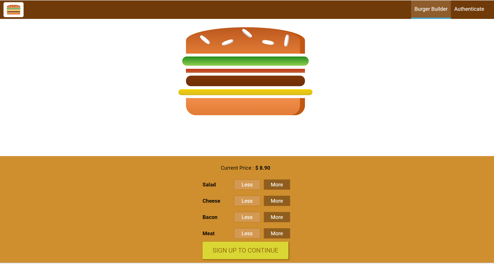

# Restaurant React App

Simple React application with firebase API, sign-in authentication, `react-router-dom` routing and globalized state management using `react-redux`.

This application emulates a basic restaurant website for ordering food.

This project was bootstrapped with [Create React App](https://github.com/facebook/create-react-app).

## Features

- Client side rendered React Application using Redux-Thunk for asynchronous requests with Axios.
- Users can login with an authorization system to purchase a food item customized to their choice.
- Robust error handling and form control.

## Future Work

- Improve visual design of the website
- Include simulation of order delivery
